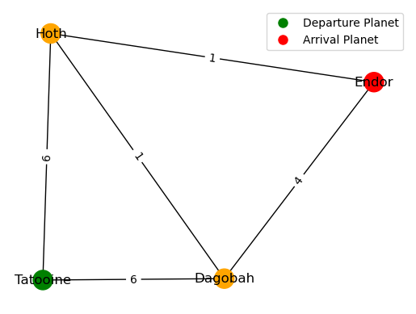

# Tell me the odds Giskard Technical Test

This repository is an answer to the [technical test](https://github.com/lioncowlionant/developer-test/tree/main) from
Giskard.ai.

The project consists in a CLI and a webapp able to compute the odds of success
for the Millennium Falcon to reach a planet before the Death Star destroys it. 


## Install notes
Simply setup a Python environment from the `requirements.txt` file: 

```
pip install -r requirements.txt
```
For convenience, we recommend to install the requirements inside a conda environment or a virtual env: 
```
conda create -n giskard_odds python=3.11
conda activate giskard_odds
pip install -r requirements.txt
```

## Getting started

### CLI
Once the Python environment is set up, the CLI can be used directly through the following command: 

```
python backend/odd_computation.py examples/example1/millennium-falcon.json examples/example1/empire.json
```

The first argument must be the path to the Millennium Falcon `.json` file, while the second argument is the path to the Empire Communication `.json` file. An optional argument `--verbose` controls the amount of logs visible, by default, only the odds are printed. 

### Front-end

The front-end consists in a simple webapp made with Flask. It can be started with: 

```
python frontend/main.py
```

The webapp is then accessible locally at [http://127.0.0.1:5000/](http://127.0.0.1:5000/). It only contains one button that allows uploading an Empire Communication file in the `.json` format. It then computes the odds of success as well as a possible strategy (itinerary with refueling and stops) to achieve these odds.

It uses the Millenium Config and Routes from the examples provided in the original repository. These are stored in the `frontend/static/ressources/` folder. If the number of planets is small enough, a graph of the galaxy is displayed in the webapp as well (see below).



## Odds computation approach

To compute the odds, a graph of the galaxy is built using the NetworkX Python library. First, the CLI checks if there is a path from the departure and arrival planets and if it can be achieved without any stops. Then, all the paths between the two planets are computed, if the path is short enough (i.e. if the Falcon can refuel before the end of the countdown), the odds are computed by looking at the best combination of stops along the path. 

This solution gives correct answers but can be quite computationally heavy as it looks for every possible combination of stops for all paths between departure and arrival planets. A more efficient algorithm could certainly be derived using A* and a carefully designed heuristic (so it ensures maximal odds of success). The difficulty of such an approach would be the time changing heuristic as the bounty hunters are not always present on the planets. This could likely be handled with A* star generalization such as [Generalized Adaptive A*](http://idm-lab.org/bib/abstracts/papers/aamas08b.pdf). 


## Test correctness

In order to assess the correctness of the algorithm and its modules, run:
```
python test/test.py
```

It will run test about the odds computation on each example within the
`examples` folder and also some unit tests to assess the correctness of the
functions used during the odds computation.
